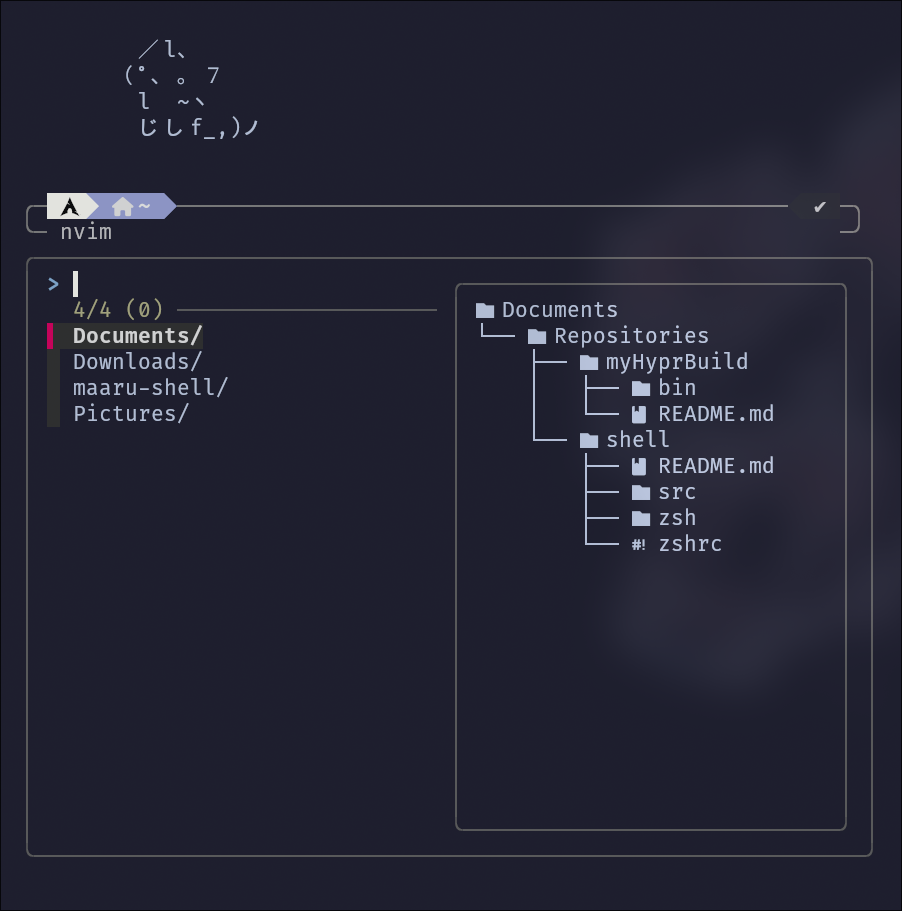
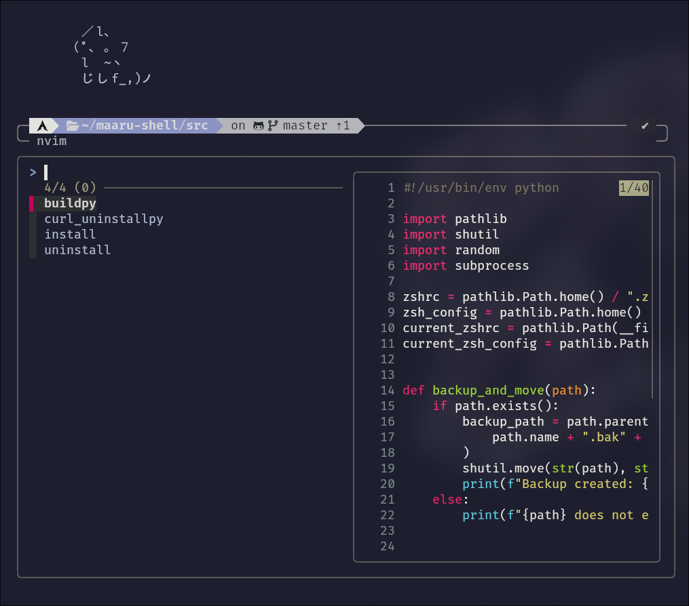

# Shell - maaru

**maaru Shell** is an enhanced and fast Zsh shell with numerous plugins and customizations for improved performance and usability.

##### ---------- hot link ----------

[ > \_**\_install\_\_** <](#Installation) <br />
[ > \_**\_uninstall\_\_** <](#Installation) <br />
[ > \_**\_Example\_\_** <](#Example) <br />
[ > \_**\_dependencies\_\_** <](#Dependencies) <br />

### Features:

- Uses **Powerlevel10k** for a beautiful and customizable prompt.
- Includes powerful utilities like **fzf**, **bat**, **zoxide**, and **eza** for better file handling and search functionality.
- Uses the **Zinit** plugin manager, which significantly speeds up plugin loading.
- Supports abbreviations similar to the **Fish shell** for faster command execution, with manual plugin configuration options.

### Dependencies

- for zsh
  `fzf`,
  `bat`,
  `eza, exa,`,
  `git`,
  `zoxide`,
  `z`,

---

- for your system
  `zsh`
  `curl`
  `python`

---

- if your system **macOS** `pbcopy`
- if your system **linux_X11** `xsel, xclip`
- if your system **linux_Wayland** `wl-clipboard`
- for **zsh-vi-mode** supports copy in normal mode with `y`

# Example

## fzf-tab

#### supports eza




# and more plugins

[zinit plugins](zsh/karnel/core/__zinit__/plugins)

### Installation

To quickly install the shell, run the following command:

```bash
curl -sSL https://raw.githubusercontent.com/maarutan/shell/master/src/install | sh
```

### Uninstallation

To uninstall the shell, run the following command:

```bash
curl -sSL https://raw.githubusercontent.com/maarutan/shell/master/src/uninstall | sh
```
